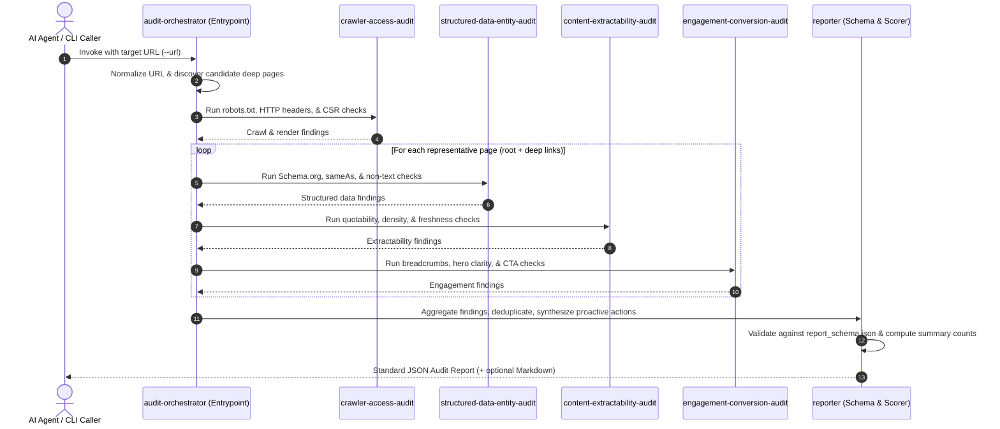

# Brand AI-Readiness Audit — Agent Skill Marketplace
> **Adobe University Hackathon 2026 — Round 3: Development Round**  
> Built strictly to the [`agentskills.io`](https://agentskills.io) specification.

An autonomous, multi-skill agent marketplace that enables any general AI agent to audit any target website automatically. It diagnoses the concrete, repeatable failure modes that hurt a brand's **AI Discoverability** (why the brand isn't found or cited by AI assistants like ChatGPT, Claude, Perplexity, and Gemini) and **On-Site Engagement** (why visitors who arrive via AI citations bounce without converting) — and produces a prioritized, evidence-backed audit report.

---

## 🏛️ Marketplace Architecture & Skills Overview

The marketplace decomposes audit reasoning into 5 narrowly-scoped, highly-focused skills under a single orchestrator entrypoint:

```
brand-ai-readiness-audit/
├── marketplace.json                 # Marketplace manifest declaring skills and entrypoint
├── README.md                        # Architecture, skill descriptions, and composition guide
├── imple.md                         # Technical implementation specification & diff history
├── tests/                           # Automated test suite and mock site fixtures
│   └── test_marketplace.py         # End-to-end integration test (6/6 passing)
└── skills/
    ├── audit-orchestrator/          # [ENTRYPOINT] Composes sub-skills, aggregates & emits report
    │   ├── SKILL.md
    │   ├── scripts/
    │   │   ├── orchestrate.py       # Master orchestration runner
    │   │   └── reporter.py          # Schema validator, scoring engine, & formatter
    │   └── references/
    │       ├── report_schema.json   # Contest JSON schema for final report
    │       └── composition_flow.md  # Composition sequence and contracts
    │
    ├── crawler-access-audit/        # Concern: Machine access, robots.txt, headers, CSR/render gaps
    │   ├── SKILL.md
    │   ├── scripts/
    │   │   └── check_crawl_render.py # Detects AI bot blocks, WAF shields, CSR shells, sitemaps
    │   └── references/
    │       ├── crawler_agents.json  # Catalog of AI retrieval crawler user agents
    │       └── render_heuristics.md # CSR hydration wall vs static SSR heuristics
    │
    ├── structured-data-entity-audit/# Concern: Schema.org, entity disambiguation, non-text lock
    │   ├── SKILL.md
    │   ├── scripts/
    │   │   └── check_structured_data.py # Schema validator, sameAs grounding, alt text & tables
    │   └── references/
    │       ├── schema_templates.md  # Production JSON-LD snippets (Org, Product, FAQ)
    │       └── entity_rules.md      # Wikidata & Knowledge Graph grounding guidelines
    │
    ├── content-extractability-audit/# Concern: AI quotability, RAG friendliness, freshness, density
    │   ├── SKILL.md
    │   ├── scripts/
    │   │   └── check_extractability.py # Inverted pyramid definitions, density, freshness, llms.txt
    │   └── references/
    │       ├── llmstxt_spec.md      # Specification & best practices for /llms.txt
    │       └── quotability_guide.md # RAG chunking & snippet extraction heuristics
    │
    └── engagement-conversion-audit/ # Concern: Deep-link context, orientation, friction, CTAs
        ├── SKILL.md
        ├── scripts/
        │   └── check_engagement.py  # Breadcrumbs, above-fold hero, modal friction, CTAs
        └── references/
            ├── engagement_rubric.md # UX heuristics for AI referral visitors
            └── orientation_checklist.md # Deep landing context retention checklist
```

---

## 🔍 What Each Skill Does

### 1. `audit-orchestrator` (Entrypoint)
- **Role**: Coordinates the entire audit lifecycle for any given URL or domain.
- **Actions**: Discovers representative site pages (homepage + deep paths like `/products`, `/docs`, `/pricing`), dispatches the specialized child skills against target endpoints, collects findings, eliminates duplicate reports, calculates counts-by-severity summaries and category scores, generates forward-looking proactive recommendations, and validates the output strictly against the contest schema.

### 2. `crawler-access-audit`
- **Concern**: Machine crawlability, bot restrictions, and rendering pipeline.
- **Failure Modes Detected**:
  - `F-CRAWL-AI-BOTS-BLOCKED`: `robots.txt` disallows AI retrieval agents (`GPTBot`, `ClaudeBot`, `PerplexityBot`, `Google-Extended`, `CCBot`, etc.).
  - `F-CRAWL-UNIVERSAL-DISALLOW`: Root `Disallow: /` blocking all automated crawlers.
  - `F-CRAWL-CSR-HYDRATION-WALL`: Client-Side Rendering (CSR) hydration wall where initial raw HTML is an empty container shell (`<div id="root"></div>`) with near-zero static text, blinding AI retrieval agents that do not run heavy headless browser engines.
  - `F-CRAWL-META-NOINDEX`: `<meta name="robots" content="noindex">` or HTTP `X-Robots-Tag: noindex/nosnippet`.
  - `F-CRAWL-SITEMAP-MISSING`: Absence or invalid format of `/sitemap.xml`.

### 3. `structured-data-entity-audit`
- **Concern**: Machine understandability, semantic knowledge graphs, and non-text facts.
- **Failure Modes Detected**:
  - `F-DATA-MISSING-ORG-SCHEMA`: Missing `Organization` or `WebSite` Schema.org JSON-LD.
  - `F-DATA-MISSING-PRODUCT-SCHEMA`: Commercial/product pages missing `Product`, `SoftwareApplication`, or `Offer` schemas.
  - `F-DATA-ENTITY-SAMEAS-ABSENT`: Entity ambiguity — lack of `sameAs` links to authoritative Knowledge Graph hubs (Wikidata, Wikipedia, LinkedIn, Crunchbase).
  - `F-DATA-NONTEXT-ALT-MISSING`: Informational images, charts, and diagrams missing descriptive `alt` text.
  - `F-DATA-CANVAS-LOCKED-CONTENT`: Data tables or graphs trapped in `<canvas>` without textual equivalents.
  - `F-DATA-HEADING-NO-H1` / `F-DATA-HEADING-MULTIPLE-H1`: Broken or ambiguous semantic heading hierarchy.

### 4. `content-extractability-audit`
- **Concern**: RAG chunking friendliness, answer quotability, freshness, and AI context protocols.
- **Failure Modes Detected**:
  - `F-CONT-LOW-QUOTABILITY`: Opening 250 words lack a crisp, declarative definition ("X is a [category] that [core function]"), reducing the probability of AI search engines selecting the site as a direct quote.
  - `F-CONT-LOW-DENSITY`: Boilerplate and navigation clutter exceed 70% of visible text, causing scraping parsers (Readability/Trafilatura) to discard the page.
  - `F-CONT-STALE-COPYRIGHT`: Outdated copyright years (e.g. `<= 2024` on a 2026 audit) signaling unmaintained claims.
  - `F-CONT-LLMSTXT-MISSING`: Absence of `/llms.txt` or `/llms-full.txt` (the standard markdown index for LLM agents).

### 5. `engagement-conversion-audit`
- **Concern**: On-site visitor orientation, deep-link context retention, interaction friction, and conversion pathways.
- **Failure Modes Detected**:
  - `F-ENG-DEEP-NO-BREADCRUMBS`: Visitors landing directly on deep pages from an AI citation lack breadcrumb navigation (`<nav aria-label="breadcrumb">`) or parent hierarchy anchors.
  - `F-ENG-HERO-UNCLEAR`: Hero section lacks an explanatory value proposition subhead visible above the fold.
  - `F-ENG-INTRUSIVE-OVERLAYS`: Obstructive modal dialogs (`[role="dialog"]`, newsletter popups) that interrupt reading on load.
  - `F-ENG-MISSING-CTA`: Lack of prominent, clearly worded Call-to-Action buttons guiding the visitor to convert.

---

## 🔄 How the Entry Point Composes the Skills



1. **Resolution & Discovery**: The orchestrator receives the target URL, verifies HTTPS connectivity, and samples representative internal links (e.g. `/products`, `/pricing`, `/docs`, `/about`).
2. **Deterministic Dispatch**: The orchestrator invokes the 4 focused skills against the target domain and sampled pages. Each skill operates as a clean, decoupled module returning structured findings with severity and evidence.
3. **Synthesis & Deduplication**: Findings are collected, deduplicated across pages, and augmented with proactive beyond-problem enhancements (such as `/llms.txt` and Wikidata entity grounding).
4. **Validation & Emission**: `reporter.py` validates that required fields (`site`, `audited_at`, `summary`, `findings`) are present, calculates summary statistics (`total_findings`, `critical`, `high`, `medium`), and emits the standard JSON report.

---

## 📋 Sample Audit Report Output

The output strictly matches the contest schema:

```json
{
  "site": "example.com",
  "audited_at": "2026-09-13T09:39:27Z",
  "summary": {
    "total_findings": 5,
    "critical": 0,
    "high": 1,
    "medium": 4,
    "low": 0,
    "discoverability_score": 61,
    "engagement_score": 92
  },
  "findings": [
    {
      "id": "F-DATA-MISSING-ORG-SCHEMA",
      "title": "Missing Organization or WebSite JSON-LD structured data",
      "severity": "high",
      "category": "discoverability",
      "evidence": "Homepage https://example.com contains no Organization, Corporation, or WebSite Schema.org markup.",
      "suggested_action": {
        "summary": "Add Schema.org Organization JSON-LD to establish definitive brand entity identity.",
        "priority": "high",
        "details": "Declare brand name, legal name, URL, logo, and knowledge graph sameAs identifiers.",
        "code_example": "{\n  \"@context\": \"https://schema.org\",\n  \"@type\": \"Organization\",\n  \"name\": \"BrandName\",\n  \"url\": \"https://example.com\",\n  \"logo\": \"https://example.com/logo.png\"\n}"
      }
    }
  ],
  "proactive_recommendations": [
    {
      "title": "Adopt the /llms.txt AI Context Standard",
      "impact": "High",
      "recommendation": "Deploy /llms.txt and /llms-full.txt at the website root containing curated markdown links and concise summaries of documentation, products, and APIs."
    }
  ]
}
```

---

## ⚡ Quickstart & Usage

### 1. Run the Full Orchestrated Audit
```bash
python skills/audit-orchestrator/scripts/orchestrate.py --url https://example.com --output report.json
```

To output both JSON and a human-readable Markdown summary:
```bash
python skills/audit-orchestrator/scripts/orchestrate.py --url https://example.com --format both --output report
```

### 2. Run Individual Focused Skills Standalone
```bash
# Audit crawlability and CSR hydration walls
python skills/crawler-access-audit/scripts/check_crawl_render.py --url https://example.com

# Audit Schema.org structured data and entity disambiguation
python skills/structured-data-entity-audit/scripts/check_structured_data.py --url https://example.com

# Audit AI quotability, information density, and /llms.txt
python skills/content-extractability-audit/scripts/check_extractability.py --url https://example.com

# Audit deep-link orientation, breadcrumbs, and CTAs
python skills/engagement-conversion-audit/scripts/check_engagement.py --url https://example.com/features
```

### 3. Run Automated Tests
```bash
python tests/test_marketplace.py
```

### 4. Validate All Skills against `agentskills.io`
```bash
npx skills-ref validate skills/audit-orchestrator
npx skills-ref validate skills/crawler-access-audit
npx skills-ref validate skills/structured-data-entity-audit
npx skills-ref validate skills/content-extractability-audit
npx skills-ref validate skills/engagement-conversion-audit
```

---

## 🛡️ Scope, Guardrails & Compliance

- **Read-Only & Safe**: The marketplace only performs read-only HTTP GET requests with strict timeouts (8s) and polite rate limits. No live site modifications, no authenticated areas, no destructive actions.
- **Universal Generalization**: Operates on unseen websites dynamically by analyzing universal architectural patterns (RFC 9309 robots directives, DOM tree structures, Schema.org vocabulary, semantic HTML5, and text heuristics) rather than hardcoded site characteristics.
- **Lightweight Package**: Package size is < 1 MB (well under the 50 MB limit, containing zero pre-trained model weights).
- **Execution Speed**: Typical audit runtime is under 15 seconds (well within the < 5 minutes constraint).
