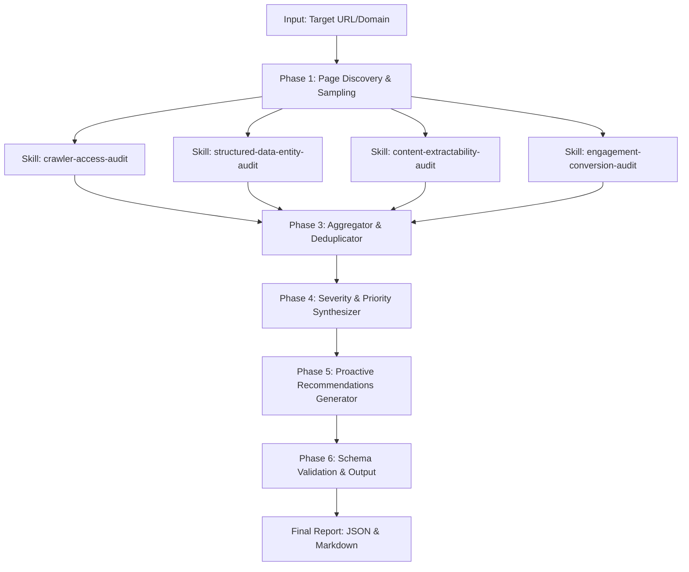

# Audit Orchestrator: Composition & Execution Flow

This reference describes how `audit-orchestrator` coordinates the specialized skills in the marketplace.

## Orchestration Pipeline

## Composition Rules

1. **Sub-Skill Execution Contract**:
   - Each specialized skill is completely self-contained. It can be invoked as an independent CLI tool or via Python module import.
   - Each skill returns findings adhering to the sub-finding interface:
     - `id`: unique identifier (e.g. `F-CRAWL-001`, `F-DATA-002`, `F-CONT-001`, `F-ENG-001`)
     - `title`: human-readable description of defect
     - `severity`: `"critical"`, `"high"`, `"medium"`, or `"low"`
     - `category`: `"discoverability"` or `"engagement"`
     - `evidence`: factual proof observed during crawl
     - `suggested_action`: `{ "summary": "...", "priority": "...", "details": "...", "code_example": "..." }`

2. **Deduplication & Severity Sorting**:
   - Findings are grouped by ID or target page.
   - Summaries count `critical`, `high`, and `medium` findings.
   - Findings are sorted by severity descending (`critical` > `high` > `medium` > `low`).

3. **Resilience & Guardrails**:
   - Timeouts enforced per request (default: 8.0s).
   - Entire audit execution completes in < 5 minutes.
   - All network calls are strictly read-only (HTTP GET/HEAD).
   - User-Agent identifying as `Mozilla/5.0 (compatible; BrandAIAuditAgent/1.0; +https://agentskills.io)`.
   - Never attempts authentication, form submissions, or modifying operations.
